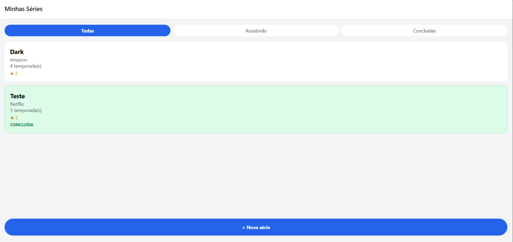

# Minhas Séries

App mobile (Expo + React Native + TypeScript) para registrar as séries
que assisti ou estou assistindo, com dados salvos em SQLite.

## Como rodar
npm install
npx expo start -c

## Teste de persistência

## Diário do copiloto

### Registro 1 — Etapa 1
**O que eu pedi:** um passo a passo completo do projeto, com os comandos e o conteúdo das telas, seguindo o enunciado.
**O que a IA sugeriu (resumo):** criar o projeto com `create-expo-app`, instalar os pacotes do Expo com `npx expo install` e o NativeWind 4 com `npm install ... --legacy-peer-deps`, trocar o `main` para `expo-router/entry`, adicionar o `scheme` e criar os 5 arquivos do NativeWind, com `import '../global.css'` na primeira linha do `_layout.tsx`.
**O que eu fiz:** aceitei, porque bate com o que vimos nas Aulas 1 a 3 (`npx expo install` para pacotes do Expo, NativeWind versão 4). Conferi os comandos contra o enunciado antes de rodar.

### Registro 2 — Etapa 4
**O que eu pedi:** o repositório de séries com as 6 funções, sem import do React e com `?` em todas as queries.
**O que a IA sugeriu (resumo):** `getSeries` com três queries fixas (uma por filtro), usando `WHERE concluida = ?` com o valor `[0]` ou `[1]`, em vez de `.filter()` no JavaScript. Também sugeriu `toggleSerieConcluida` com `concluida = 1 - concluida` e `createSerie` devolvendo o objeto montado com `result.lastInsertRowId`.
**O que eu fiz:** aceitei e estudei cada query. O filtro no SQL é exigido pelo enunciado, e entendi que `1 - concluida` inverte 0 e 1 sem precisar ler o valor antes.

### Registro 3 — Etapa 5 (Parte 3 do enunciado)
**O que eu pedi:** como recarregar a lista ao voltar do formulário.
**O que a IA sugeriu (resumo):** usar `useFocusEffect` envolvendo a função em `useCallback`, com `[filtro]` nas dependências, em vez de `useEffect` com `[]`.
**O que eu fiz:** aceitei. Entendi que a lista fica "embaixo" na pilha e não é montada de novo, então o `useEffect([])` não roda. O `useCallback` dá uma função estável ao hook, que senão rodaria a cada render. Usei o mesmo padrão no `detalhe.tsx`, para atualizar os dados depois de editar.

### Registro 4 — Etapa 6
**O que eu pedi:** o formulário único para criar e editar, com validação.
**O que a IA sugeriu (resumo):** ler `id` com `useLocalSearchParams`, converter com `Number(id)` (o parâmetro chega como `string`), validar `temporadas` com `Number.isInteger` e `>= 0`, e usar `nota === n ? null : n` para remover a nota ao tocar de novo na selecionada.
**O que eu fiz:** aceitei, e consigo explicar cada linha. A conversão com `Number()` evita o erro de formulário vazio na edição, e a validação evita salvar `NaN` ou texto em `temporadas`.

### Registro 5 — Etapa 8 (erro de `.wasm` no terminal)
**O que eu pedi:** ajuda com o erro `Unable to resolve "./wa-sqlite/wa-sqlite.wasm"` no `expo-sqlite`.
**O que a IA sugeriu (resumo):** o erro acontecia porque o app estava rodando na versão Web. Ela deu duas opções: (1) rodar no Expo Go ou emulador, sem usar a web; (2) adicionar `config.resolver.assetExts.push("wasm")` no `metro.config.js`.
**O que eu fiz:** rejeitei a opção 2, porque o projeto é mobile e o SQLite na web é experimental, exigindo headers extras. Adaptei: passei a testar só no Expo Go, que é onde o teste de persistência do enunciado faz sentido.

### Registro 6 — Etapa 8 (dados não persistiam)
**O que eu pedi:** por que os dados sumiam ao fechar e abrir o app.
**O que a IA sugeriu (resumo):** eu estava testando em `http://localhost:8081`, isto é, no navegador, onde o `expo-sqlite` não persiste de forma confiável. Ela sugeriu abrir o projeto no Expo Go (QR Code, ou `--tunnel` se a rede bloquear) ou no emulador Android, e refazer o teste.
**O que eu fiz:** corrigi o meu teste: passei a rodar no celular/emulador. Aprendi que "fechar o app" no navegador não equivale a fechar o app no celular, e que só o teste no mobile vale como evidência de persistência.